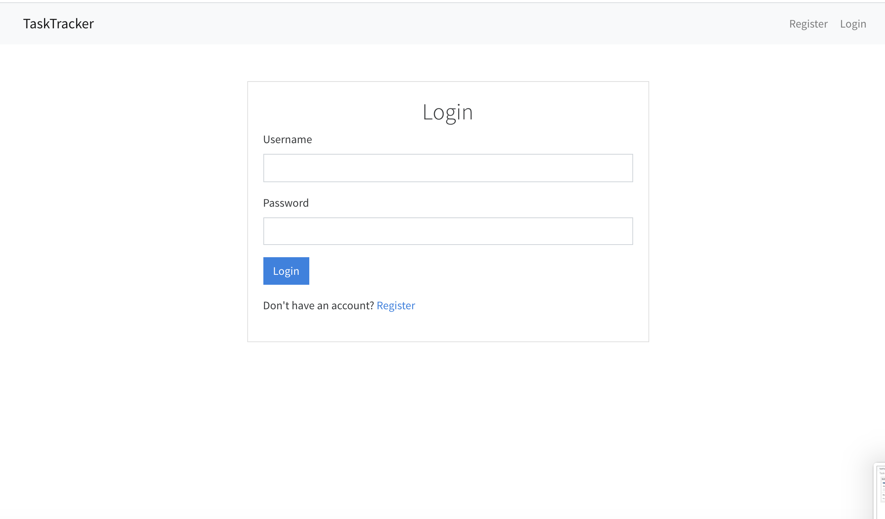
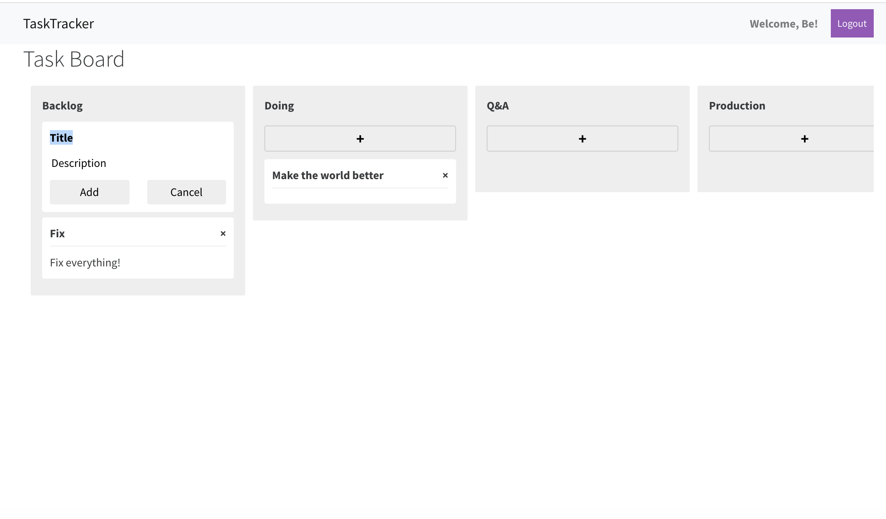
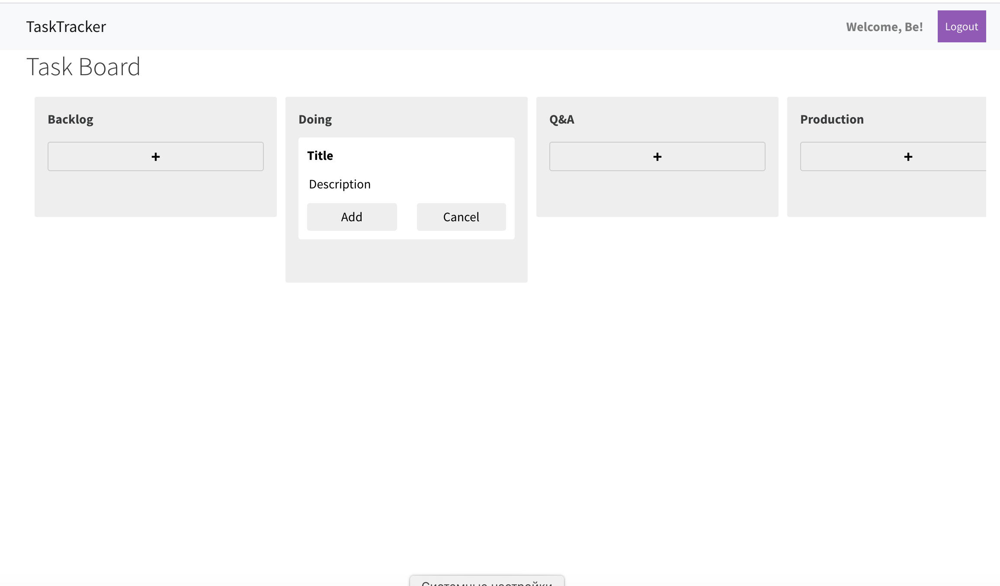

# TaskTracker

TaskTracker is a React-based web application which provides you a task board.

## Quick Start

```bash
# Install dependencies
npm install
yarn install

# Serve API on localhost:8000
python leadmanager/manage.py runserver

# Run webpack (from root)
npm run dev

# Build for production
npm run build
```

## Images



